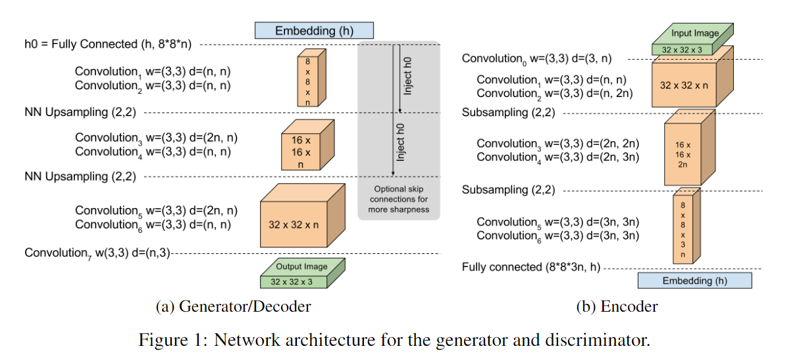
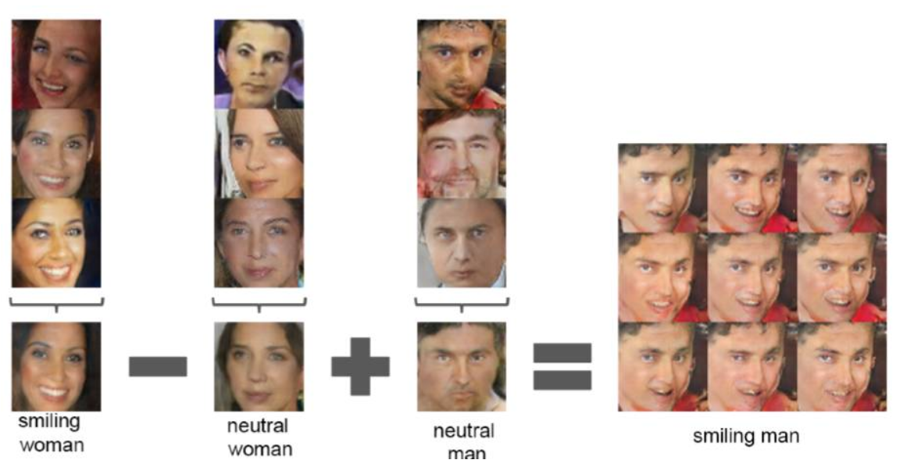

# 总结

本文参考自许多总结，如：

<https://blog.csdn.net/qq_25737169/article/details/78857788>

[http://nooverfit.com/wp/%E7%8B%AC%E5%AE%B6%EF%BD%9Cgan%E5%A4%A7%E7%9B%98%E7%82%B9%EF%BC%8C%E8%81%8A%E8%81%8A%E8%BF%99%E4%BA%9B%E5%B9%B4%E7%9A%84%E7%94%9F%E6%88%90%E5%AF%B9%E6%8A%97%E7%BD%91%E7%BB%9C-lsgan-wgan-cgan-info/](http://nooverfit.com/wp/独家｜gan大盘点，聊聊这些年的生成对抗网络-lsgan-wgan-cgan-info/)

本文整理**GAN生成优化的理论**，有：

- GAN（原始版本）
- LSGAN：最小二乘优化
- WGAN：证明为何不收敛
- WGAN-GP：优化WGAN
- EBGAN：结合能量概念
- BEGAN：EBGAN的修改，生成图像更光滑
- .......

关于**生成数据的不同模型**，有：

- BGAN：生成离散样本
- CGAN：条件GAN
- ACGAN：辅助条件GAN（感觉比CGAN好一些）
- infoGAN：使用互信息进行约束，使随机变量z具有可解释性
- ......

各种各样的**花式操作**，有：

- SS-GAN（嵌套GAN）
- pix2pix（图像转换）
- Dual-GAN（对偶学习， 和下面的DiscoGAN，CycleGAN十分相似）
- DiscoGAN
- CycleGAN（学习domain信息）
- .......

# GAN（base）

### 相关连接

论文原文：<https://arxiv.org/abs/1406.2661>

理论证明的blog：<https://blog.csdn.net/stalbo/article/details/79283399>

### 理论

GAN的基本原理其实非常简单，这里以生成图片为例进行说明。假设我们有两个网络，G（Generator）和D（Discriminator）。正如它的名字所暗示的那样，它们的功能分别是：

- G是一个生成图片的网络，它接收一个随机的噪声z，通过这个噪声生成图片，记做G(z)。
- D是一个判别网络，判别一张图片是不是“真实的”。它的输入参数是x，x代表一张图片，输出D（x）代表x为真实图片的概率，如果为1，就代表100%是真实的图片，而输出为0，就代表不可能是真实的图片。

在训练过程中，**生成网络G的目标就是尽量生成真实的图片去欺骗判别网络D。而D的目标就是尽量把G生成的图片和真实的图片分别开来。**这样，G和D构成了一个动态的“博弈过程”。

最后博弈的结果是什么？**在最理想的状态下，**G可以生成足以“以假乱真”的图片G(z)。对于D来说，它难以判定G生成的图片究竟是不是真实的，因此D(G(z)) = 0.5。

- 整个式子由两项构成。x表示真实图片，z表示输入G网络的噪声，而G(z)表示G网络生成的图片。
- D(x)表示D网络判断**真实图片是否真实**的概率（因为x就是真实的，所以对于D来说，这个值越接近1越好）。而D(G(z))是**D网络判断G生成的图片的是否真实的概率。**
- G的目的：上面提到过，$D(G(z))$是**D网络判断G生成的图片是否真实的概率**，G应该希望自己生成的图片“越接近真实越好”。也就是说，$G$希望$D(G(z))$尽可能得大，这时$V(D, G)$会变小。因此我们看到式子的最前面的记号是$min_G$。
- D的目的：$D$的能力越强，$D(x)$应该越大，$D(G(x))$应该越小。这时$V(D,G)$会变大。因此式子对于D来说是求最大($max_D$)

#### Algorithm

### 问题

- 解决不收敛（non-convergence）的问题。 
  目前面临的基本问题是：所有的理论都认为 GAN 应该在纳什均衡（Nash equilibrium）上有卓越的表现，但梯度下降只有在凸函数的情况下才能保证实现纳什均衡。当博弈双方都由神经网络表示时，在没有实际达到均衡的情况下，让它们永远保持对自己策略的调整是可能的[OpenAI Ian Goodfellow的Quora](<https://mp.weixin.qq.com/s?__biz=MzA3MzI4MjgzMw==&mid=2650718178&idx=1&sn=6144523762955325b7567f7d69a593bd&scene=1&srcid=0821xPdRwK2wIHNzgOLXqUrw&pass_ticket=uG39FkNWWjsW38Aa2v5b3cfMhixqsJ0l1XLhNr5mivWEaLyW5R1QED0uAKHOwuGw#rd>)。
- 难以训练：崩溃问题（collapse problem） 
  GAN模型被定义为极小极大问题，没有损失函数，在训练过程中很难区分是否正在取得进展。GAN的学习过程可能发生崩溃问题（collapse problem），生成器开始退化，总是生成同样的样本点，无法继续学习。当生成模型崩溃时，判别模型也会对相似的样本点指向相似的方向，训练无法继续。【[Improved Techniques for Training GANs](<https://arxiv.org/abs/1606.03498>)】
- 无需预先建模，模型过于自由不可控。 
  与其他生成式模型相比，GAN这种竞争的方式不再要求一个假设的数据分布，即不需要formulate p(x)，而是使用一种分布直接进行采样sampling，从而真正达到理论上可以完全逼近真实数据，这也是GAN最大的优势。然而，这种不需要预先建模的方法缺点是太过自由了，对于较大的图片，较多的 pixel的情形，基于简单 GAN 的方式就不太可控了(超高维)。在GAN[Goodfellow Ian, Pouget-Abadie J] 中，每次学习参数的更新过程，被设为D更新k回，G才更新1回，也是出于类似的考虑。

**关于这些问题的理论推导在本文下面“WGAN”部分**

# LSGAN（loss 改进）

这一算法是对GAN loss的一种改进。大致看看就行，WGAN更好一些。

### 链接

<https://zhuanlan.zhihu.com/p/25768099>

<https://arxiv.org/abs/1611.04076>

tensorflow/pytorch: [wiseodd/generative-models](https://link.zhihu.com/?target=https%3A//github.com/wiseodd/generative-models)

### 算法

最小二乘GAN，正如它的名字所指示的，目标函数将是一个平方误差，考虑到D网络的目标是分辨两类，如果给生成样本和真实样本分别编码为![[公式]](https://www.zhihu.com/equation?tex=a%2Cb)，那么采用平方误差作为目标函数，D的目标就是(PS: 经网友指正，原来此处有错误，D不再是原始GAN的最大化目标函数，而是最小化，现更正并致谢！)

![[公式]](https://www.zhihu.com/equation?tex=%5Cmin_D+L%28D%29+%3D+%5Cmathbb%7BE%7D_%7Bx+%5Csim+p_x%7D+%28D%28x%29-b%29%5E2+%2B+%5Cmathbb%7BE%7D_%7Bz+%5Csim+p_z%7D+%28D%28G%28z%29%29-a%29%5E2)

G的目标函数将编码![[公式]](https://www.zhihu.com/equation?tex=a)换成编码![[公式]](https://www.zhihu.com/equation?tex=c)，这个编码表示D将G生成的样本当成真实样本，

![[公式]](https://www.zhihu.com/equation?tex=%5Cmin_G+L%28G%29+%3D+%5Cmathbb%7BE%7D_%7Bz+%5Csim+p_z%7D+%28D%28G%28z%29%29-c%29%5E2)

在下一节我们会证明，当![[公式]](https://www.zhihu.com/equation?tex=b-c%3D1%2C+b-a%3D2)时，目标函数等价于皮尔森卡方散度（Pearson ![[公式]](https://www.zhihu.com/equation?tex=%5Cchi%5E2)divergence）。一般来说，取![[公式]](https://www.zhihu.com/equation?tex=a%3D-1%2C+b%3D1%2C+c%3D0)或者![[公式]](https://www.zhihu.com/equation?tex=a%3D-1%2C+b%3Dc%3D1)。作者说，这两种设置在实验中效果没有显著差别（**实际上，用DCGAN代码修改目标函数为平方误差，然后发现在MNIST上，前者效果还可以，但是后者就只能产生噪声了，两者的差别只有a,b,c的取值！或许这还跟网络架构有关，我用的不是LSGAN论文中的网络架构**）。

### LSGAN收敛性

LSGAN收敛性可以套用原始GAN的证明框架：

固定G以后，我们能够求出最优的D，令D的目标函数的导数为0，不难求得

![[公式]](https://www.zhihu.com/equation?tex=D%5E%5Cast%28x%29%3D%5Cfrac%7Bbp_d%28x%29%2Bap_g%28x%29%7D%7Bp_d%28x%29%2Bp_g%28x%29%7D)

将这个结果代入到![[公式]](https://www.zhihu.com/equation?tex=L%28G%29)中，对![[公式]](https://www.zhihu.com/equation?tex=L%28G%29)我们人为地添加一个与G无关的常数项![[公式]](https://www.zhihu.com/equation?tex=+%5Cmathbb%7BE%7D_%7Bx+%5Csim+p_x%7D+%28D%28x%29-c%29%5E2)，化简以后就得到了

![[公式]](https://www.zhihu.com/equation?tex=L%28G%29%3D%5Cint_%7B%5Cmathcal%7BX%7D%7D+%5Cfrac%7B%28%28b-c%29%28p_d%28x%29%2Bp_g%28x%29%29-%28b-a%29p_g%28x%29%29%5E2%7D%7Bp_d%28x%29%2Bp_g%28x%29%7Ddx)

当![[公式]](https://www.zhihu.com/equation?tex=b-c%3D1%2C+b-a%3D2)时，

![[公式]](https://www.zhihu.com/equation?tex=L%28G%29%3D0.5%5Cchi%5E2_%7B%5Ctext%7BPearson%7D%7D%28p_d%2Bp_g%7C%7C2p_g%29)

也就是说，此时优化LSGAN等价于优化皮尔森卡方散度。

类似地，我们可以构造出其他散度对应的目标函数，KL散度和皮尔森卡方散度都属于 f 散度， 常见的 f 散度有

KL divergence: ![[公式]](https://www.zhihu.com/equation?tex=f%28t%29%3Dt%5Clog+t)

![[公式]](https://www.zhihu.com/equation?tex=%5Cchi%5E2) divergence: ![[公式]](https://www.zhihu.com/equation?tex=f%28t%29%3D%28t-1%29%5E2%2C+t%5E2-1)

reversed KL divergence: ![[公式]](https://www.zhihu.com/equation?tex=f%28t%29%3D-%5Clog+t)

Hellinger distance: ![[公式]](https://www.zhihu.com/equation?tex=f%28t%29%3D%28%5Csqrt+t-1%29%5E2%2C+2%281-%5Csqrt+t%29)

Total variation distance: ![[公式]](https://www.zhihu.com/equation?tex=f%28t%29%3D0.5%7Ct-1%7C)

### 总结

选择最小二乘Loss做更新有两个好处, 1. 更严格地惩罚远离数据集的离群Fake sample, 使得生成图片更接近真实数据(同时图像也更清晰) 2. 最小二乘保证离群sample惩罚更大, 解决了原本GAN训练不充分(不稳定)的问题:

但缺点也是明显的, LSGAN对离离群点的过度惩罚, 可能导致样本生成的”多样性”降低, 生成样本很可能只是对真实样本的简单”模仿”和细微改动.

# WGAN（理论分析GAN不收敛原因）

### 相关链接

https://arxiv.org/abs/1701.07875

<https://arxiv.org/abs/1701.04862>

https://zhuanlan.zhihu.com/p/25071913

某源码实现：<https://github.com/Zeleni9/pytorch-wgan/blob/master/models/wgan_clipping.py>

### method

- 判别器最后一层去掉sigmoid
- 生成器和判别器的loss不取log
- 对更新后的权重强制截断到一定范围内，比如[-0.01，0.01]，以满足论文中提到的lipschitz连续性条件。
-  论文中也推荐使用SGD， RMSprop等优化器，不要基于使用动量的优化算法

### contributions

- WGAN理论上给出了**GAN训练不稳定的原因**，即交叉熵（JS散度）不适合衡量具有不相交部分的分布之间的距离，转而使用wassertein距离去衡量生成数据分布和真实数据分布之间的距离，理论上解决了训练不稳定的问题。
- 对GAN的训练提供了一个指标，此指标数值越小，表示GAN训练的越差，反之越好。可以说之前训练GAN完全就和买彩票一样，训练好了算你中奖，没中奖也不要气馁，多买几注吧。

### theory

以下内容复制自<https://zhuanlan.zhihu.com/p/25071913>

#### 第一部分：原始GAN究竟出了什么问题？

原始GAN中判别器要最小化如下损失函数，尽可能把真实样本分为正例，生成样本分为负例：

$$
min_D[\mathbb{E}_{x\sim P_r}[\log D(x)] + \mathbb{E}_{x\sim P_g}[\log(1-D(x))]]
$$

（公式1 ）

其中![[公式]](https://www.zhihu.com/equation?tex=P_r)是真实样本分布，![[公式]](https://www.zhihu.com/equation?tex=P_g)是由生成器产生的样本分布。对于生成器，Goodfellow一开始提出来一个损失函数，后来又提出了一个改进的损失函数，分别是

![[公式]](https://www.zhihu.com/equation?tex=%5Cmathbb%7BE%7D_%7Bx%5Csim+P_g%7D%5B%5Clog%281-D%28x%29%29%5D) （公式2）

![[公式]](https://www.zhihu.com/equation?tex=%5Cmathbb%7BE%7D_%7Bx%5Csim+P_g%7D%5B-+%5Clog+D%28x%29%5D) （公式3）

后者在WGAN两篇论文中称为“the - log D alternative”或“the - log D trick”。WGAN前作分别分析了这两种形式的原始GAN各自的问题所在，下面分别说明。

#### 第一种原始GAN形式的问题

**一句话概括：判别器越好，生成器梯度消失越严重。**WGAN前作从两个角度进行了论证，第一个角度是从生成器的等价损失函数切入的。

首先从公式1可以得到，在生成器G固定参数时最优的判别器D应该是什么。对于一个具体的样本![[公式]](https://www.zhihu.com/equation?tex=x)，它可能来自真实分布也可能来自生成分布，它对公式1损失函数的贡献是

![[公式]](https://www.zhihu.com/equation?tex=-+P_r%28x%29+%5Clog+D%28x%29+-+P_g%28x%29+%5Clog+%5B1+-+D%28x%29%5D)

令其关于![[公式]](https://www.zhihu.com/equation?tex=D%28x%29)的导数为0，得

![[公式]](https://www.zhihu.com/equation?tex=-+%5Cfrac%7BP_r%28x%29%7D%7BD%28x%29%7D+%2B+%5Cfrac%7BP_g%28x%29%7D%7B1+-+D%28x%29%7D+%3D+0)

化简得最优判别器为：

![[公式]](https://www.zhihu.com/equation?tex=D%5E%2A%28x%29+%3D+%5Cfrac%7BP_r%28x%29%7D%7BP_r%28x%29+%2B+P_g%28x%29%7D)（公式4）

这个结果从直观上很容易理解，就是看一个样本![[公式]](https://www.zhihu.com/equation?tex=x)来自真实分布和生成分布的可能性的相对比例。如果![[公式]](https://www.zhihu.com/equation?tex=P_r%28x%29+%3D+0)且![[公式]](https://www.zhihu.com/equation?tex=P_g%28x%29+%5Cneq+0)，最优判别器就应该非常自信地给出概率0；如果![[公式]](https://www.zhihu.com/equation?tex=P_r%28x%29+%3D+P_g%28x%29)，说明该样本是真是假的可能性刚好一半一半，此时最优判别器也应该给出概率0.5。

然而GAN训练有一个trick，就是别把判别器训练得太好，否则在实验中生成器会完全学不动（loss降不下去），为了探究背后的原因，我们就可以看看在极端情况——判别器最优时，生成器的损失函数变成什么。给公式2加上一个不依赖于生成器的项，使之变成

![[公式]](https://www.zhihu.com/equation?tex=%5Cmathbb%7BE%7D_%7Bx%5Csim+P_r%7D%5B%5Clog+D%28x%29%5D+%2B+%5Cmathbb%7BE%7D_%7Bx%5Csim+P_g%7D%5B%5Clog%281-D%28x%29%29%5D)

注意，最小化这个损失函数等价于最小化公式2，而且它刚好是判别器损失函数的反。代入最优判别器即公式4，再进行简单的变换可以得到

![[公式]](https://www.zhihu.com/equation?tex=%5Cmathbb%7BE%7D_%7Bx+%5Csim+P_r%7D+%5Clog+%5Cfrac%7BP_r%28x%29%7D%7B%5Cfrac%7B1%7D%7B2%7D%5BP_r%28x%29+%2B+P_g%28x%29%5D%7D+%2B+%5Cmathbb%7BE%7D_%7Bx+%5Csim+P_g%7D+%5Clog+%5Cfrac%7BP_g%28x%29%7D%7B%5Cfrac%7B1%7D%7B2%7D%5BP_r%28x%29+%2B+P_g%28x%29%5D%7D+-+2%5Clog+2)（公式5)

变换成这个样子是为了引入Kullback–Leibler divergence（简称KL散度）和Jensen-Shannon divergence（简称JS散度）这两个重要的相似度衡量指标，后面的主角之一Wasserstein距离，就是要来吊打它们两个的。所以接下来介绍这两个重要的配角——KL散度和JS散度：

![[公式]](https://www.zhihu.com/equation?tex=KL%28P_1%7C%7CP_2%29+%3D+%5Cmathbb%7BE%7D_%7Bx+%5Csim+P_1%7D+%5Clog+%5Cfrac%7BP_1%7D%7BP_2%7D)（公式6）

![[公式]](https://www.zhihu.com/equation?tex=JS%28P_1+%7C%7C+P_2%29+%3D+%5Cfrac%7B1%7D%7B2%7DKL%28P_1%7C%7C%5Cfrac%7BP_1+%2B+P_2%7D%7B2%7D%29+%2B+%5Cfrac%7B1%7D%7B2%7DKL%28P_2%7C%7C%5Cfrac%7BP_1+%2B+P_2%7D%7B2%7D%29)（公式7）

于是公式5就可以继续写成

![[公式]](https://www.zhihu.com/equation?tex=2JS%28P_r+%7C%7C+P_g%29+-+2%5Clog+2)

（公式8）

到这里读者可以先喘一口气，看看目前得到了什么结论：**根据原始GAN定义的判别器loss，我们可以得到最优判别器的形式；而在最优判别器的下，我们可以把原始GAN定义的生成器loss等价变换为最小化真实分布![[公式]](https://www.zhihu.com/equation?tex=P_r)与生成分布![[公式]](https://www.zhihu.com/equation?tex=P_g)之间的JS散度。我们越训练判别器，它就越接近最优，最小化生成器的loss也就会越近似于最小化![[公式]](https://www.zhihu.com/equation?tex=P_r)和![[公式]](https://www.zhihu.com/equation?tex=P_g)之间的JS散度。**

问题就出在这个JS散度上。我们会希望如果两个分布之间越接近它们的JS散度越小，我们通过优化JS散度就能将![[公式]](https://www.zhihu.com/equation?tex=P_g)“拉向”![[公式]](https://www.zhihu.com/equation?tex=P_r)，最终以假乱真。这个希望在两个分布有所重叠的时候是成立的，但是如果两个分布完全没有重叠的部分，或者它们重叠的部分可忽略（下面解释什么叫可忽略），它们的JS散度是多少呢？

答案是![[公式]](https://www.zhihu.com/equation?tex=%5Clog+2)，因为对于任意一个x只有四种可能：

![[公式]](https://www.zhihu.com/equation?tex=P_1%28x%29+%3D+0)且![[公式]](https://www.zhihu.com/equation?tex=P_2%28x%29+%3D+0)

![[公式]](https://www.zhihu.com/equation?tex=P_1%28x%29+%5Cneq+0)且![[公式]](https://www.zhihu.com/equation?tex=P_2%28x%29+%5Cneq+0)

![[公式]](https://www.zhihu.com/equation?tex=P_1%28x%29+%3D+0)且![[公式]](https://www.zhihu.com/equation?tex=P_2%28x%29+%5Cneq+0)

![[公式]](https://www.zhihu.com/equation?tex=P_1%28x%29+%5Cneq+0)且![[公式]](https://www.zhihu.com/equation?tex=P_2%28x%29+%3D+0)

第一种对计算JS散度无贡献，第二种情况由于重叠部分可忽略所以贡献也为0，第三种情况对公式7右边第一个项的贡献是![[公式]](https://www.zhihu.com/equation?tex=%5Clog+%5Cfrac%7BP_2%7D%7B%5Cfrac%7B1%7D%7B2%7D%28P_2+%2B+0%29%7D+%3D+%5Clog+2)，第四种情况与之类似，所以最终![[公式]](https://www.zhihu.com/equation?tex=JS%28P_1%7C%7CP_2%29+%3D+%5Clog+2)。

换句话说，无论![[公式]](https://www.zhihu.com/equation?tex=P_r)跟![[公式]](https://www.zhihu.com/equation?tex=P_g%0A)是远在天边，还是近在眼前，只要它们俩没有一点重叠或者重叠部分可忽略，JS散度就固定是常数![[公式]](https://www.zhihu.com/equation?tex=%5Clog+2)，**而这对于梯度下降方法意味着——梯度为0**！此时对于最优判别器来说，生成器肯定是得不到一丁点梯度信息的；即使对于接近最优的判别器来说，生成器也有很大机会面临梯度消失的问题。

但是![[公式]](https://www.zhihu.com/equation?tex=P_r)与![[公式]](https://www.zhihu.com/equation?tex=P_g)不重叠或重叠部分可忽略的可能性有多大？不严谨的答案是：非常大。比较严谨的答案是：**当![[公式]](https://www.zhihu.com/equation?tex=P_r)与![[公式]](https://www.zhihu.com/equation?tex=P_g)的支撑集（support）是高维空间中的低维流形（manifold）时，![[公式]](https://www.zhihu.com/equation?tex=P_r)与![[公式]](https://www.zhihu.com/equation?tex=P_g)重叠部分测度（measure）为0的概率为1。**

不用被奇怪的术语吓得关掉页面，虽然论文给出的是严格的数学表述，但是直观上其实很容易理解。首先简单介绍一下这几个概念：

- 支撑集（support）其实就是函数的非零部分子集，比如ReLU函数的支撑集就是![[公式]](https://www.zhihu.com/equation?tex=%280%2C+%2B%5Cinfty%29)，一个概率分布的支撑集就是所有概率密度非零部分的集合。
- 流形（manifold）是高维空间中曲线、曲面概念的拓广，我们可以在低维上直观理解这个概念，比如我们说三维空间中的一个曲面是一个二维流形，因为它的本质维度（intrinsic dimension）只有2，一个点在这个二维流形上移动只有两个方向的自由度。同理，三维空间或者二维空间中的一条曲线都是一个一维流形。
- 测度（measure）是高维空间中长度、面积、体积概念的拓广，可以理解为“超体积”。

回过头来看第一句话，“当![[公式]](https://www.zhihu.com/equation?tex=P_r)与![[公式]](https://www.zhihu.com/equation?tex=P_g)的支撑集是高维空间中的低维流形时”，基本上是成立的。原因是GAN中的生成器一般是从某个低维（比如100维）的随机分布中采样出一个编码向量，再经过一个神经网络生成出一个高维样本（比如64x64的图片就有4096维）。当生成器的参数固定时，生成样本的概率分布虽然是定义在4096维的空间上，但它本身所有可能产生的变化已经被那个100维的随机分布限定了，其本质维度就是100，再考虑到神经网络带来的映射降维，最终可能比100还小，所以生成样本分布的支撑集就在4096维空间中构成一个最多100维的低维流形，“撑不满”整个高维空间。

“撑不满”就会导致真实分布与生成分布难以“碰到面”，这很容易在二维空间中理解：一方面，二维平面中随机取两条曲线，它们之间刚好存在重叠线段的概率为0；另一方面，虽然它们很大可能会存在交叉点，但是相比于两条曲线而言，交叉点比曲线低一个维度，长度（测度）为0，可忽略。三维空间中也是类似的，随机取两个曲面，它们之间最多就是比较有可能存在交叉线，但是交叉线比曲面低一个维度，面积（测度）是0，可忽略。从低维空间拓展到高维空间，就有了如下逻辑：因为一开始生成器随机初始化，所以![[公式]](https://www.zhihu.com/equation?tex=P_g)几乎不可能与![[公式]](https://www.zhihu.com/equation?tex=P_r)有什么关联，所以它们的支撑集之间的重叠部分要么不存在，要么就比![[公式]](https://www.zhihu.com/equation?tex=P_r)和![[公式]](https://www.zhihu.com/equation?tex=P_g)的最小维度还要低至少一个维度，故而测度为0。所谓“重叠部分测度为0”，就是上文所言“不重叠或者重叠部分可忽略”的意思。

我们就得到了WGAN前作中关于生成器梯度消失的第一个论证：**在（近似）最优判别器下，最小化生成器的loss等价于最小化![[公式]](https://www.zhihu.com/equation?tex=P_r)与![[公式]](https://www.zhihu.com/equation?tex=P_g)之间的JS散度，而由于![[公式]](https://www.zhihu.com/equation?tex=P_r)与![[公式]](https://www.zhihu.com/equation?tex=P_g)几乎不可能有不可忽略的重叠，所以无论它们相距多远JS散度都是常数![[公式]](https://www.zhihu.com/equation?tex=%5Clog+2)，最终导致生成器的梯度（近似）为0，梯度消失。**

接着作者写了很多公式定理从第二个角度进行论证，但是背后的思想也可以直观地解释：

- 首先，![[公式]](https://www.zhihu.com/equation?tex=P_r)与![[公式]](https://www.zhihu.com/equation?tex=P_g)之间几乎不可能有不可忽略的重叠，所以无论它们之间的“缝隙”多狭小，都肯定存在一个最优分割曲面把它们隔开，最多就是在那些可忽略的重叠处隔不开而已。
- 由于判别器作为一个神经网络可以无限拟合这个分隔曲面，所以存在一个最优判别器，对几乎所有真实样本给出概率1，对几乎所有生成样本给出概率0，而那些隔不开的部分就是难以被最优判别器分类的样本，但是它们的测度为0，可忽略。
- 最优判别器在真实分布和生成分布的支撑集上给出的概率都是常数（1和0），导致生成器的loss梯度为0，梯度消失。

有了这些理论分析，原始GAN不稳定的原因就彻底清楚了：**判别器训练得太好，生成器梯度消失，生成器loss降不下去；判别器训练得不好，生成器梯度不准，四处乱跑。只有判别器训练得不好不坏才行，但是这个火候又很难把握，甚至在同一轮训练的前后不同阶段这个火候都可能不一样，所以GAN才那么难训练。**

实验辅证如下：

> WGAN前作Figure 2。先分别将DCGAN训练1，20，25个epoch，然后固定生成器不动，判别器重新随机初始化从头开始训练，对于第一种形式的生成器loss产生的梯度可以打印出其尺度的变化曲线，可以看到随着判别器的训练，生成器的梯度均迅速衰减。注意y轴是对数坐标轴。

#### 第二种原始GAN形式的问题

**一句话概括：最小化第二种生成器loss函数，会等价于最小化一个不合理的距离衡量，导致两个问题，一是梯度不稳定，二是collapse mode即多样性不足。**WGAN前作又是从两个角度进行了论证，下面只说第一个角度，因为对于第二个角度我难以找到一个直观的解释方式，感兴趣的读者还是去看论文吧（逃）。

如前文所说，Ian Goodfellow提出的“- log D trick”是把生成器loss改成

![[公式]](https://www.zhihu.com/equation?tex=%5Cmathbb%7BE%7D_%7Bx%5Csim+P_g%7D%5B-+%5Clog+D%28x%29%5D)（公式3） 

上文推导已经得到在最优判别器![[公式]](https://www.zhihu.com/equation?tex=D%5E%2A)下

![[公式]](https://www.zhihu.com/equation?tex=%5Cmathbb%7BE%7D_%7Bx%5Csim+P_r%7D%5B%5Clog+D%5E%2A%28x%29%5D+%2B+%5Cmathbb%7BE%7D_%7Bx%5Csim+P_g%7D%5B%5Clog%281-D%5E%2A%28x%29%29%5D+%3D+2JS%28P_r+%7C%7C+P_g%29+-+2%5Clog+2)（公式9）

我们可以把KL散度（注意下面是先g后r）变换成含![[公式]](https://www.zhihu.com/equation?tex=D%5E%2A)的形式：

![[公式]](https://www.zhihu.com/equation?tex=%5Cbegin%7Balign%7D%0AKL%28P_g+%7C%7C+P_r%29+%26%3D+%5Cmathbb%7BE%7D_%7Bx+%5Csim+P_g%7D+%5B%5Clog+%5Cfrac%7BP_g%28x%29%7D%7BP_r%28x%29%7D%5D+%5C%5C%0A%26%3D+%5Cmathbb%7BE%7D_%7Bx+%5Csim+P_g%7D+%5B%5Clog+%5Cfrac%7BP_g%28x%29+%2F+%28P_r%28x%29+%2B+P_g%28x%29%29%7D%7BP_r%28x%29+%2F+%28P_r%28x%29+%2B+P_g%28x%29%29%7D%5D+%5C%5C%0A%26%3D+%5Cmathbb%7BE%7D_%7Bx+%5Csim+P_g%7D+%5B%5Clog+%5Cfrac%7B1+-+D%5E%2A%28x%29%7D%7BD%5E%2A%28x%29%7D%5D+%5C%5C%0A%26%3D+%5Cmathbb%7BE%7D_%7Bx+%5Csim+P_g%7D+%5Clog+%5B1+-+D%5E%2A%28x%29%5D+-++%5Cmathbb%7BE%7D_%7Bx+%5Csim+P_g%7D+%5Clog+D%5E%2A%28x%29%0A%5Cend%7Balign%7D+%5C%5C)（公式10）

由公式3，9，10可得最小化目标的等价变形

![[公式]](https://www.zhihu.com/equation?tex=%5Cbegin%7Balign%7D%0A%5Cmathbb%7BE%7D_%7Bx+%5Csim+P_g%7D+%5B-%5Clog+D%5E%2A%28x%29%5D+%26%3D++KL%28P_g+%7C%7C+P_r%29+-++%5Cmathbb%7BE%7D_%7Bx+%5Csim+P_g%7D+%5Clog+%5B1+-+D%5E%2A%28x%29%5D+%5C%5C%0A%26%3D+KL%28P_g+%7C%7C+P_r%29+-+2JS%28P_r+%7C%7C+P_g%29+%2B+2%5Clog+2+%2B+%5Cmathbb%7BE%7D_%7Bx%5Csim+P_r%7D%5B%5Clog+D%5E%2A%28x%29%5D%0A%5Cend%7Balign%7D)

注意上式最后两项不依赖于生成器G，最终得到最小化公式3等价于最小化

![[公式]](https://www.zhihu.com/equation?tex=KL%28P_g+%7C%7C+P_r%29+-+2JS%28P_r+%7C%7C+P_g%29)（公式11）

这个等价最小化目标存在两个严重的问题。第一是它同时要最小化生成分布与真实分布的KL散度，却又要最大化两者的JS散度，一个要拉近，一个却要推远！这在直观上非常荒谬，在数值上则会导致梯度不稳定，这是后面那个JS散度项的毛病。

第二，即便是前面那个正常的KL散度项也有毛病。因为KL散度不是一个对称的衡量，![[公式]](https://www.zhihu.com/equation?tex=KL%28P_g+%7C%7C+P_r%29)与![[公式]](https://www.zhihu.com/equation?tex=KL%28P_r+%7C%7C+P_g%29)是有差别的。以前者为例

- 当![[公式]](https://www.zhihu.com/equation?tex=P_g%28x%29%5Crightarrow+0)而![[公式]](https://www.zhihu.com/equation?tex=P_r%28x%29%5Crightarrow+1)时，![[公式]](https://www.zhihu.com/equation?tex=P_g%28x%29+%5Clog+%5Cfrac%7BP_g%28x%29%7D%7BP_r%28x%29%7D+%5Crightarrow+0)，对![[公式]](https://www.zhihu.com/equation?tex=KL%28P_g+%7C%7C+P_r%29)贡献趋近0
- 当![[公式]](https://www.zhihu.com/equation?tex=P_g%28x%29%5Crightarrow+1)而![[公式]](https://www.zhihu.com/equation?tex=P_r%28x%29%5Crightarrow+0)时，![[公式]](https://www.zhihu.com/equation?tex=P_g%28x%29+%5Clog+%5Cfrac%7BP_g%28x%29%7D%7BP_r%28x%29%7D+%5Crightarrow+%2B%5Cinfty)，对![[公式]](https://www.zhihu.com/equation?tex=KL%28P_g+%7C%7C+P_r%29)贡献趋近正无穷

换言之，![[公式]](https://www.zhihu.com/equation?tex=KL%28P_g+%7C%7C+P_r%29)对于上面两种错误的惩罚是不一样的，第一种错误对应的是“生成器没能生成真实的样本”，惩罚微小；第二种错误对应的是“生成器生成了不真实的样本” ，惩罚巨大。第一种错误对应的是缺乏多样性，第二种错误对应的是缺乏准确性。**这一放一打之下，生成器宁可多生成一些重复但是很“安全”的样本，也不愿意去生成多样性的样本，因为那样一不小心就会产生第二种错误，得不偿失。这种现象就是大家常说的collapse mode。**

**第一部分小结：在原始GAN的（近似）最优判别器下，第一种生成器loss面临梯度消失问题，第二种生成器loss面临优化目标荒谬、梯度不稳定、对多样性与准确性惩罚不平衡导致mode collapse这几个问题。**

实验辅证如下：

> WGAN前作Figure 3。先分别将DCGAN训练1，20，25个epoch，然后固定生成器不动，判别器重新随机初始化从头开始训练，对于第二种形式的生成器loss产生的梯度可以打印出其尺度的变化曲线，可以看到随着判别器的训练，蓝色和绿色曲线中生成器的梯度迅速增长，说明梯度不稳定，红线对应的是DCGAN相对收敛的状态，梯度才比较稳定。

#### 第二部分：WGAN之前的一个过渡解决方案  

原始GAN问题的根源可以归结为两点，一是等价优化的距离衡量（KL散度、JS散度）不合理，二是生成器随机初始化后的生成分布很难与真实分布有不可忽略的重叠。

WGAN前作其实已经针对第二点提出了一个解决方案，就是对生成样本和真实样本加噪声，直观上说，使得原本的两个低维流形“弥散”到整个高维空间，强行让它们产生不可忽略的重叠。而一旦存在重叠，JS散度就能真正发挥作用，此时如果两个分布越靠近，它们“弥散”出来的部分重叠得越多，JS散度也会越小而不会一直是一个常数，于是（在第一种原始GAN形式下）梯度消失的问题就解决了。在训练过程中，我们可以对所加的噪声进行**退火（annealing）**，慢慢减小其方差，到后面两个低维流形“本体”都已经有重叠时，就算把噪声完全拿掉，JS散度也能照样发挥作用，继续产生有意义的梯度把两个低维流形拉近，直到它们接近完全重合。以上是对原文的直观解释。

在这个解决方案下我们可以放心地把判别器训练到接近最优，不必担心梯度消失的问题。而当判别器最优时，对公式9取反可得判别器的最小loss为

![[公式]](https://www.zhihu.com/equation?tex=%5Cbegin%7Balign%7D%0A%5Cmin+L_D%28P_%7Br%2B%5Cepsilon%7D%2C+P_%7Bg%2B%5Cepsilon%7D%29+%26%3D+-+%5Cmathbb%7BE%7D_%7Bx%5Csim+P_%7Br%2B%5Cepsilon%7D%7D%5B%5Clog+D%5E%2A%28x%29%5D+-+%5Cmathbb%7BE%7D_%7Bx%5Csim+P_%7Bg%2B%5Cepsilon%7D%7D%5B%5Clog%281-D%5E%2A%28x%29%29%5D+%5C%5C%0A%26%3D+2%5Clog+2+-+2JS%28P_%7Br%2B%5Cepsilon%7D+%7C%7C+P_%7Bg%2B%5Cepsilon%7D%29%0A%5Cend%7Balign%7D)

其中![[公式]](https://www.zhihu.com/equation?tex=P_%7Br%2B%5Cepsilon%7D)和![[公式]](https://www.zhihu.com/equation?tex=P_%7Bg%2B%5Cepsilon%7D)分别是加噪后的真实分布与生成分布。反过来说，从最优判别器的loss可以反推出当前两个加噪分布的JS散度。两个加噪分布的JS散度可以在某种程度上代表两个原本分布的距离，也就是说可以通过最优判别器的loss反映训练进程！……真的有这样的好事吗？

并没有，因为加噪JS散度的具体数值受到噪声的方差影响，随着噪声的退火，前后的数值就没法比较了，所以它不能成为![[公式]](https://www.zhihu.com/equation?tex=P_r)和![[公式]](https://www.zhihu.com/equation?tex=P_g)距离的本质性衡量。

因为本文的重点是WGAN本身，所以WGAN前作的加噪方案简单介绍到这里，感兴趣的读者可以阅读原文了解更多细节。**加噪方案是针对原始GAN问题的第二点根源提出的，解决了训练不稳定的问题，不需要小心平衡判别器训练的火候，可以放心地把判别器训练到接近最优，但是仍然没能够提供一个衡量训练进程的数值指标。但是WGAN本作就从第一点根源出发，用Wasserstein距离代替JS散度，同时完成了稳定训练和进程指标的问题！**

作者未对此方案进行实验验证。 

#### 第三部分：Wasserstein距离的优越性质

##### 关于Wasserstein距离的介绍

<https://www.jiqizhixin.com/articles/19031102>

<https://zhuanlan.zhihu.com/p/35879231>

##### 关于Lipschitz连续

<https://www.zhihu.com/question/51809602>

> 所以总体来说，Lipschitz连续的函数是比连续函数较更加“光滑”，但不一定是处处光滑的，比如![[公式]](https://www.zhihu.com/equation?tex=%7Cx%7C).但不光滑的点不多，放在一起是一个零测集，所以他是几乎处处的光滑的。
>
> Lipschitz连续，要求函数图像的曲线上任意两点连线的斜率一致有界，就是任意的斜率都小于同一个常数，这个常数就是Lipschitz常数。
>
> - 从局部看：我们可以取两个充分接近的点，如果这个时候斜率的极限存在的话，这个斜率的极限就是这个点的导数。也就是说函数可导，又是Lipschitz连续，那么导数有界。反过来，如果可导函数，导数有界，可以推出函数Lipschitz连续。
>
> - 从整体看：Lipschitz连续要求函数在无限的区间上不能有超过线性的增长，所以![[公式]](https://www.zhihu.com/equation?tex=x%5E2%2Ce%5Ex)这些函数在无限区间上不是Lipschitz连续的。
>
> 

##### 正文

Wasserstein距离又叫Earth-Mover（EM）距离，定义如下：

![[公式]](https://www.zhihu.com/equation?tex=W%28P_r%2C+P_g%29+%3D+%5Cinf_%7B%5Cgamma+%5Csim+%5CPi+%28P_r%2C+P_g%29%7D+%5Cmathbb%7BE%7D_%7B%28x%2C+y%29+%5Csim+%5Cgamma%7D+%5B%7C%7Cx+-+y%7C%7C%5D)（公式12）

解释如下：![[公式]](https://www.zhihu.com/equation?tex=%5CPi+%28P_r%2C+P_g%29)是![[公式]](https://www.zhihu.com/equation?tex=P_r)和![[公式]](https://www.zhihu.com/equation?tex=P_g)组合起来的所有可能的联合分布的集合，反过来说，![[公式]](https://www.zhihu.com/equation?tex=%5CPi+%28P_r%2C+P_g%29)中每一个分布的边缘分布都是![[公式]](https://www.zhihu.com/equation?tex=P_r)和![[公式]](https://www.zhihu.com/equation?tex=P_g)。对于每一个可能的联合分布![[公式]](https://www.zhihu.com/equation?tex=%5Cgamma)而言，可以从中采样![[公式]](https://www.zhihu.com/equation?tex=%28x%2C+y%29+%5Csim+%5Cgamma)得到一个真实样本![[公式]](https://www.zhihu.com/equation?tex=x)和一个生成样本![[公式]](https://www.zhihu.com/equation?tex=y)，并算出这对样本的距离![[公式]](https://www.zhihu.com/equation?tex=%7C%7Cx-y%7C%7C)，所以可以计算该联合分布![[公式]](https://www.zhihu.com/equation?tex=%5Cgamma)下样本对距离的期望值![[公式]](https://www.zhihu.com/equation?tex=%5Cmathbb%7BE%7D_%7B%28x%2C+y%29+%5Csim+%5Cgamma%7D+%5B%7C%7Cx+-+y%7C%7C%5D)。在所有可能的联合分布中能够对这个期望值取到的下界![[公式]](https://www.zhihu.com/equation?tex=%5Cinf_%7B%5Cgamma+%5Csim+%5CPi+%28P_r%2C+P_g%29%7D+%5Cmathbb%7BE%7D_%7B%28x%2C+y%29+%5Csim+%5Cgamma%7D+%5B%7C%7Cx+-+y%7C%7C%5D)，就定义为Wasserstein距离。

直观上可以把![[公式]](https://www.zhihu.com/equation?tex=%5Cmathbb%7BE%7D_%7B%28x%2C+y%29+%5Csim+%5Cgamma%7D+%5B%7C%7Cx+-+y%7C%7C%5D)理解为在![[公式]](https://www.zhihu.com/equation?tex=%5Cgamma)这个“路径规划”下把![[公式]](https://www.zhihu.com/equation?tex=P_r)这堆“沙土”挪到![[公式]](https://www.zhihu.com/equation?tex=P_g)“位置”所需的“消耗”，而![[公式]](https://www.zhihu.com/equation?tex=W%28P_r%2C+P_g%29)就是“最优路径规划”下的“最小消耗”，所以才叫Earth-Mover（推土机）距离。

**Wasserstein距离相比KL散度、JS散度的优越性在于，即便两个分布没有重叠，Wasserstein距离仍然能够反映它们的远近。**WGAN本作通过简单的例子展示了这一点。考虑如下二维空间中的两个分布![[公式]](https://www.zhihu.com/equation?tex=P_1)和![[公式]](https://www.zhihu.com/equation?tex=P_2)，![[公式]](https://www.zhihu.com/equation?tex=P_1)在线段AB上均匀分布，![[公式]](https://www.zhihu.com/equation?tex=P_2)在线段CD上均匀分布，通过控制参数![[公式]](https://www.zhihu.com/equation?tex=%5Ctheta)可以控制着两个分布的距离远近。

此时容易得到（读者可自行验证）

![[公式]](https://www.zhihu.com/equation?tex=KL%28P_1+%7C%7C+P_2%29+%3D+KL%28P_1+%7C%7C+P_2%29+%3D%0A%5Cbegin%7Bcases%7D%0A%2B%5Cinfty+%26+%5Ctext%7Bif+%24%5Ctheta+%5Cneq+0%24%7D+%5C%5C%0A0+%26+%5Ctext%7Bif+%24%5Ctheta+%3D+0%24%7D%0A%5Cend%7Bcases%7D)（突变）

![[公式]](https://www.zhihu.com/equation?tex=JS%28P_1%7C%7CP_2%29%3D%0A%5Cbegin%7Bcases%7D%0A%5Clog+2+%26+%5Ctext%7Bif+%24%5Ctheta+%5Cneq+0%24%7D+%5C%5C%0A0+%26+%5Ctext%7Bif+%24%5Ctheta+-+0%24%7D%0A%5Cend%7Bcases%7D)（突变）

![[公式]](https://www.zhihu.com/equation?tex=W%28P_0%2C+P_1%29+%3D+%7C%5Ctheta%7C)（平滑）

KL散度和JS散度是突变的，要么最大要么最小，**Wasserstein距离却是平滑的**，如果我们要用梯度下降法优化![[公式]](https://www.zhihu.com/equation?tex=%5Ctheta)这个参数，前两者根本提供不了梯度，Wasserstein距离却可以。类似地，在高维空间中如果两个分布不重叠或者重叠部分可忽略，则KL和JS既反映不了远近，也提供不了梯度，**但是Wasserstein却可以提供有意义的梯度**。

#### 第四部分：从Wasserstein距离到WGAN

既然Wasserstein距离有如此优越的性质，如果我们能够把它定义为生成器的loss，不就可以产生有意义的梯度来更新生成器，使得生成分布被拉向真实分布吗？

没那么简单，因为Wasserstein距离定义（公式12）中的![[公式]](https://www.zhihu.com/equation?tex=%5Cinf_%7B%5Cgamma+%5Csim+%5CPi+%28P_r%2C+P_g%29%7D)没法直接求解，不过没关系，作者用了一个已有的定理把它变换为如下形式

![[公式]](https://www.zhihu.com/equation?tex=W%28P_r%2C+P_g%29+%3D+%5Cfrac%7B1%7D%7BK%7D+%5Csup_%7B%7C%7Cf%7C%7C_L+%5Cleq+K%7D+%5Cmathbb%7BE%7D_%7Bx+%5Csim+P_r%7D+%5Bf%28x%29%5D+-+%5Cmathbb%7BE%7D_%7Bx+%5Csim+P_g%7D+%5Bf%28x%29%5D)（公式13）

证明过程被作者丢到论文附录中了，我们也姑且不管，先看看上式究竟说了什么。

首先需要介绍一个概念——Lipschitz连续。它其实就是在一个连续函数![[公式]](https://www.zhihu.com/equation?tex=f)上面额外施加了一个限制，要求存在一个常数![[公式]](https://www.zhihu.com/equation?tex=K%5Cgeq+0)使得定义域内的任意两个元素![[公式]](https://www.zhihu.com/equation?tex=x_1)和![[公式]](https://www.zhihu.com/equation?tex=x_2)都满足

![[公式]](https://www.zhihu.com/equation?tex=%7Cf%28x_1%29+-+f%28x_2%29%7C+%5Cleq+K+%7Cx_1+-+x_2%7C)

此时称函数![[公式]](https://www.zhihu.com/equation?tex=f)的Lipschitz常数为![[公式]](https://www.zhihu.com/equation?tex=K)。

简单理解，比如说![[公式]](https://www.zhihu.com/equation?tex=f)的定义域是实数集合，那上面的要求就等价于![[公式]](https://www.zhihu.com/equation?tex=f)的导函数绝对值不超过![[公式]](https://www.zhihu.com/equation?tex=K)。再比如说![[公式]](https://www.zhihu.com/equation?tex=%5Clog+%28x%29)就不是Lipschitz连续，因为它的导函数没有上界。Lipschitz连续条件限制了一个连续函数的最大局部变动幅度。

公式13的意思就是在要求函数![[公式]](https://www.zhihu.com/equation?tex=f)的Lipschitz常数![[公式]](https://www.zhihu.com/equation?tex=%7C%7Cf%7C%7C_L)不超过![[公式]](https://www.zhihu.com/equation?tex=K)的条件下，对所有可能满足条件的![[公式]](https://www.zhihu.com/equation?tex=f)取到![[公式]](https://www.zhihu.com/equation?tex=%5Cmathbb%7BE%7D_%7Bx+%5Csim+P_r%7D+%5Bf%28x%29%5D+-+%5Cmathbb%7BE%7D_%7Bx+%5Csim+P_g%7D+%5Bf%28x%29%5D)的上界，然后再除以![[公式]](https://www.zhihu.com/equation?tex=K)。特别地，我们可以用一组参数![[公式]](https://www.zhihu.com/equation?tex=w)来定义一系列可能的函数![[公式]](https://www.zhihu.com/equation?tex=f_w)，此时求解公式13可以近似变成求解如下形式

![[公式]](https://www.zhihu.com/equation?tex=K+%5Ccdot+W%28P_r%2C+P_g%29+%5Capprox+%5Cmax_%7Bw%3A+%7Cf_w%7C_L+%5Cleq+K%7D+%5Cmathbb%7BE%7D_%7Bx+%5Csim+P_r%7D+%5Bf_w%28x%29%5D+-+%5Cmathbb%7BE%7D_%7Bx+%5Csim+P_g%7D+%5Bf_w%28x%29%5D)（公式14）

再用上我们搞深度学习的人最熟悉的那一套，不就可以把![[公式]](https://www.zhihu.com/equation?tex=f)用一个带参数![[公式]](https://www.zhihu.com/equation?tex=w)的神经网络来表示嘛！由于神经网络的拟合能力足够强大，我们有理由相信，这样定义出来的一系列![[公式]](https://www.zhihu.com/equation?tex=f_w)虽然无法囊括所有可能，但是也足以高度近似公式13要求的那个![[公式]](https://www.zhihu.com/equation?tex=sup_%7B%7C%7Cf%7C%7C_L+%5Cleq+K%7D+)了。

最后，还不能忘了满足公式14中![[公式]](https://www.zhihu.com/equation?tex=%7C%7Cf_w%7C%7C_L+%5Cleq+K)这个限制。我们其实不关心具体的K是多少，只要它不是正无穷就行，因为它只是会使得梯度变大![[公式]](https://www.zhihu.com/equation?tex=K)倍，并不会影响梯度的方向。所以作者采取了一个非常简单的做法，就是限制神经网络![[公式]](https://www.zhihu.com/equation?tex=f_%5Ctheta)的所有参数![[公式]](https://www.zhihu.com/equation?tex=w_i)的不超过某个范围![[公式]](https://www.zhihu.com/equation?tex=%5B-c%2C+c%5D)，比如![[公式]](https://www.zhihu.com/equation?tex=w_i+%5Cin+%5B-+0.01%2C+0.01%5D)，此时关于输入样本![[公式]](https://www.zhihu.com/equation?tex=x)的导数![[公式]](https://www.zhihu.com/equation?tex=%5Cfrac%7B%5Cpartial+f_w%7D%7B%5Cpartial+x%7D)也不会超过某个范围，所以一定存在某个不知道的常数![[公式]](https://www.zhihu.com/equation?tex=K)使得![[公式]](https://www.zhihu.com/equation?tex=f_w)的局部变动幅度不会超过它，Lipschitz连续条件得以满足。具体在算法实现中，只需要每次更新完![[公式]](https://www.zhihu.com/equation?tex=w)后把它clip回这个范围就可以了。

**到此为止，我们可以构造一个含参数![[公式]](https://www.zhihu.com/equation?tex=w)、最后一层不是非线性激活层的判别器网络![[公式]](https://www.zhihu.com/equation?tex=f_w)，在限制![[公式]](https://www.zhihu.com/equation?tex=w)不超过某个范围的条件下，使得**

![[公式]](https://www.zhihu.com/equation?tex=L+%3D+%5Cmathbb%7BE%7D_%7Bx+%5Csim+P_r%7D+%5Bf_w%28x%29%5D+-+%5Cmathbb%7BE%7D_%7Bx+%5Csim+P_g%7D+%5Bf_w%28x%29%5D)（公式15）

**尽可能取到最大，此时![[公式]](https://www.zhihu.com/equation?tex=L)就会近似真实分布与生成分布之间的Wasserstein距离（忽略常数倍数![[公式]](https://www.zhihu.com/equation?tex=K)）。注意原始GAN的判别器做的是真假二分类任务，所以最后一层是sigmoid，但是现在WGAN中的判别器![[公式]](https://www.zhihu.com/equation?tex=f_w)做的是近似拟合Wasserstein距离，属于回归任务，所以要把最后一层的sigmoid拿掉。**

**接下来生成器要近似地最小化Wasserstein距离，可以最小化![[公式]](https://www.zhihu.com/equation?tex=L)，由于Wasserstein距离的优良性质，我们不需要担心生成器梯度消失的问题。再考虑到![[公式]](https://www.zhihu.com/equation?tex=L)的第一项与生成器无关，就得到了WGAN的两个loss。**

![[公式]](https://www.zhihu.com/equation?tex=-+%5Cmathbb%7BE%7D_%7Bx+%5Csim+P_g%7D+%5Bf_w%28x%29%5D)（公式16，WGAN生成器loss函数） 

![[公式]](https://www.zhihu.com/equation?tex=%5Cmathbb%7BE%7D_%7Bx+%5Csim+P_g%7D+%5Bf_w%28x%29%5D-+%5Cmathbb%7BE%7D_%7Bx+%5Csim+P_r%7D+%5Bf_w%28x%29%5D)（公式17，WGAN判别器loss函数）

**公式15是公式17的反，可以指示训练进程，其数值越小，表示真实分布与生成分布的Wasserstein距离越小，GAN训练得越好。**

WGAN完整的算法流程已经贴过了，为了方便读者此处再贴一遍：

上文说过，WGAN与原始GAN第一种形式相比，只改了四点：

- 判别器最后一层去掉sigmoid
- 生成器和判别器的loss不取log
- 每次更新判别器的参数之后把它们的绝对值截断到不超过一个固定常数c
- 不要用基于动量的优化算法（包括momentum和Adam），推荐RMSProp，SGD也行

前三点都是从理论分析中得到的，已经介绍完毕；第四点却是作者从实验中发现的，属于trick，相对比较“玄”。作者发现如果使用Adam，判别器的loss有时候会崩掉，当它崩掉时，Adam给出的更新方向与梯度方向夹角的cos值就变成负数，更新方向与梯度方向南辕北辙，这意味着判别器的loss梯度是不稳定的，所以不适合用Adam这类基于动量的优化算法。作者改用RMSProp之后，问题就解决了，因为RMSProp适合梯度不稳定的情况。

对WGAN作者做了不少实验验证，本文只提比较重要的三点。第一，判别器所近似的Wasserstein距离与生成器的生成图片质量高度相关，如下所示（此即题图）：

第二，WGAN如果用类似DCGAN架构，生成图片的效果与DCGAN差不多：

但是厉害的地方在于WGAN不用DCGAN各种特殊的架构设计也能做到不错的效果，比如如果大家一起拿掉Batch Normalization的话，DCGAN就崩了：

如果WGAN和原始GAN都使用多层全连接网络（MLP），不用CNN，WGAN质量会变差些，但是原始GAN不仅质量变得更差，而且还出现了collapse mode，即多样性不足：

第三，在所有WGAN的实验中未观察到collapse mode，作者也只说应该是解决了，

最后补充一点论文没提到，但是我个人觉得比较微妙的问题。判别器所近似的Wasserstein距离能够用来指示单次训练中的训练进程，这个没错；接着作者又说它可以用于比较多次训练进程，指引调参，我倒是觉得需要小心些。比如说我下次训练时改了判别器的层数、节点数等超参，判别器的拟合能力就必然有所波动，再比如说我下次训练时改了生成器两次迭代之间，判别器的迭代次数，这两种常见的变动都会使得Wasserstein距离的拟合误差就与上次不一样。**那么这个拟合误差的变动究竟有多大，或者说不同的人做实验时判别器的拟合能力或迭代次数相差实在太大，那它们之间还能不能直接比较上述指标，我都是存疑的。**

评论区的知友

[@Minjie Xu](https://www.zhihu.com/people/822cec1d495864da61b8e7ff62aaef23)

 

进一步指出，相比于判别器迭代次数的改变，

对判别器架构超参的改变会直接影响到对应的Lipschitz常数![[公式]](https://www.zhihu.com/equation?tex=K)，进而改变近似Wasserstein距离的倍数，前后两轮训练的指标就肯定不能比较了，

这是需要在实际应用中注意的。对此我想到了一个工程化的解决方式，不是很优雅：取同样一对生成分布和真实分布，让前后两个不同架构的判别器各自拟合到收敛，看收敛到的指标差多少倍，可以近似认为是后面的

相对前面

的变化倍数，于是就可以用这个变化倍数校正前后两轮训练的指标。

#### 第五部分：总结

WGAN前作分析了Ian Goodfellow提出的原始GAN两种形式各自的问题，第一种形式等价在最优判别器下等价于最小化生成分布与真实分布之间的JS散度，由于随机生成分布很难与真实分布有不可忽略的重叠以及JS散度的突变特性，使得生成器面临梯度消失的问题；第二种形式在最优判别器下等价于既要最小化生成分布与真实分布直接的KL散度，又要最大化其JS散度，相互矛盾，导致梯度不稳定，而且KL散度的不对称性使得生成器宁可丧失多样性也不愿丧失准确性，导致collapse mode现象。

WGAN前作针对分布重叠问题提出了一个过渡解决方案，通过对生成样本和真实样本加噪声使得两个分布产生重叠，理论上可以解决训练不稳定的问题，可以放心训练判别器到接近最优，但是未能提供一个指示训练进程的可靠指标，也未做实验验证。

WGAN本作引入了Wasserstein距离，由于它相对KL散度与JS散度具有优越的平滑特性，理论上可以解决梯度消失问题。接着通过数学变换将Wasserstein距离写成可求解的形式，利用一个参数数值范围受限的判别器神经网络来最大化这个形式，就可以近似Wasserstein距离。在此近似最优判别器下优化生成器使得Wasserstein距离缩小，就能有效拉近生成分布与真实分布。WGAN既解决了训练不稳定的问题，也提供了一个可靠的训练进程指标，而且该指标确实与生成样本的质量高度相关。作者对WGAN进行了实验验证。

# WGAN-GP（WGAN优化）

### 相关链接

<https://zhuanlan.zhihu.com/p/52799555>

[[1704.00028\] Improved Training of Wasserstein GANs](https://link.zhihu.com/?target=https%3A//arxiv.org/abs/1704.00028)

### **背景介绍**

训练不稳定是GAN常见的一个问题。虽然WGAN在稳定训练方面有了比较好的进步，但是有时也只能生成较差的样本，并且有时候也比较难收敛。原因在于：WGAN采用了权重修剪（weight clipping）策略来强行满足critic上的Lipschitz约束，这将导致训练过程产生一些不希望的行为。本文提出了另一种截断修剪的策略-gradient penalty，即惩罚critic相对于其输入（由随机噪声z生成的图片，即fake image）的梯度的norm。就是这么一个简单的改进，能使WGAN的训练变得更加稳定，并且取得更高质量的生成效果。

注意：GAN之前的D网络都叫discriminator，但是由于这里不是做分类任务，WGAN作者觉得叫discriminator不太合适，于是将其叫为critic。

### 算法介绍

WGAN的方法过于粗暴，且有时会生成低质量的图片问题。WGAN-GP舍弃裁剪weight参数的方式，采用裁剪网络梯度的方式进行更新。WGAN-GP在某些情况下是WAGN的改进，与WGAN相比效果差别不大。

WGAN-GP的目标函数如下所示：

WGAN-GP相对于WGAN的改进很小，除了增加了一个正则项，其他部分都和WGAN一样。 这个正则项就是WGAN-GP中GP（gradient penalty），即梯度约束。这个约束的意思是：critic相对于原始输入的梯度的L2范数要约束在1附近（双边约束）。为什么这个约束是合理的，这里作者给了一个命题，并且在文章补充材料中给出了证明，这个证明大家有兴趣可以自己去看，这里只想简单介绍一下这个命题。这个命题说的是在最优的优化路径上（把生成分布推向真实分布的“道路”上），critic函数对其输入的梯度值恒定为1。有了这个知识后，我们可以像搞传统机器学习一样，将这个知识加入到目标函数中，以学习到更好的模型。

WGAN-GP作者加的这个约束能保证critic也是一个Lipschiz连续函数。因为critic对任意输入x的梯度都是一个含参数w的表达式，而这个梯度的L2 norm大小约束在1附近，那w也不超过某个常数。因而从保证Lipschiz连续的条件上，GP的作用跟weight clip是一样的。

跟WGAN不同的主要有几处：

- 用gradient penalty取代weight clipping
- 在生成图像上增加高斯噪声

**这个GP的引入，跟一般GAN、WGAN中通常需要加的Batch Normalization会起冲突。**因为这个GP要求critic的一个输入对应一个输出，但是BN会将一个批次中的样本进行归一化，BN是一批输入对应一批输出，因而用BN后无法正确求出critic对于每个输入样本的梯度

### **实验介绍**

作者做了很多实验，主要就是为了说明WGAN中GP用于保证Lipschiz连续的方式要比weight clip好，因而能稳定训练，并生成质量比较好的图像。具体实验结论如下：

1）WGAN中的weight clip策略，会导致学到的绝大部分weight趋近于两个极端（-c和c），但是WGAN-GP学到的梯度是均匀分布在某个区间的。见图1。

图1

2）当critic选择的是比较深的网络时，WGAN中的c值不管怎么选取，都容易出现梯度爆炸或者梯度消失问题。见图1。

图2

3）采用weight clip的策略训练出的critic无法捕获数据分布的高阶矩信息。比如图2中第二行第一列的图中，WGAN-GP生成数据的critic值基本都分布在8个高斯附近，这和输入的样本信息（8个高斯）是一致的。但是第一行第一列中，WGAN-GP生成数据的critic值就没有如此优良特性。

4）WGAN-GP比WGAN效果要好。作者在cifar10上做了对比实验，结果如图3所示。在同样实验设置下，WGAN-GP结果要明显比WGAN好，跟DCGAN差不多，但是训练要比DCGAN稳定。

图3

5）其他GAN当G或者D改变，或者加不同激活函数时，效果差别很大，有的会训练不好，有的会出现mode collapse。但是，WGAN-GP对于各种不同的结构效果都很好。实验设置和相应实验结果如图4所示。

图4

5）WGAN-GP的loss曲线是有意义的。WGAN文章中介绍到WGAN的loss是和其样本生成质量相关的，即loss越小，生成样本质量越好。WGAN-GP也保持了这个特性。不仅如此，WGAN-GP的loss还能反映出过拟合的情况。如图5所示。

# BGAN（生成离散样本）

<https://arxiv.org/abs/1702.08431>

<https://github.com/eriklindernoren/Keras-GAN/blob/master/bgan/bgan.py>

BGAN优势在于生成离散样本（当然像图像这样的连续样本也可以支持）。

原版GAN不适用于离散数据，而BGAN用来自鉴别器的估计差异度量来计算生成样本的重要性权重，为训练生成器来提供策略梯度，因此可以用离散数据进行训练。

BGAN里生成样本的重要性权重和鉴别器的判定边界紧密相关，因此叫做“寻找边界的GAN”。

# EBGAN（结合能量的概念）

<https://blog.csdn.net/u011636567/article/details/70245346>

[http://nooverfit.com/wp/%E5%9F%BA%E4%BA%8E%E8%83%BD%E9%87%8F%E6%A8%A1%E5%9E%8B%E7%9A%84%E7%94%9F%E6%88%90%E5%AF%B9%E6%8A%97%E7%BD%91%E7%BB%9C-%E7%94%9F%E6%88%90%E5%AF%B9%E6%8A%97%E7%BD%91%E7%BB%9C%E8%BF%9B%E9%98%B6/](http://nooverfit.com/wp/基于能量模型的生成对抗网络-生成对抗网络进阶/)

<https://arxiv.org/pdf/1609.03126v2.pdf>

<https://blog.csdn.net/a312863063/article/details/88125429>

EBGAN的改变在discriminator上。把D看作是一个energy function，对real image赋予低能量，fake image赋予高能量。而且作者称通过energy based思想可以把能量方面的很多工具拿来用进去。也许是因为我对能量这方面了解很少，所以意识不到这篇文章的创新之处和重要作用。在INTRODUCTION中作者提到本文的贡献有四： 

1. 对GAN提供了一个energy based的解释，并其由此可以对GAN使用一系列能量方面的工具。 

2. 通过网格穷举搜索实验，验证了GAN和EBGAN的超参数和架构setting的完备集。

> through an exhaustive grid search experiment, we validate a complete set of hyper-parameter 
> and architectural setting with regard to both GANs and EBGANs within a fully-connected 
> workhouse. EBGANs demonstrate better training stability and enhanced robustness with respect to different hyper-parameter and meta-parameter (architectural) settings, in the pursuit to 
> reduce human efforts for tuning GANs;

3. 提出了一个pull-away term来防止Generator生成一样的图片，即mode collapse问题。所谓pull-away即“推开”，意思是不让生成的图片“扎堆”，也就是让生成的图片不一样。 

4. 实验证明EBGAN可以生成高分辨率的图片（256×256）。

   
   
   

   主要改变在D里面。EBGAN把D变成了一个AutoEncoder，输出E为Encoder和Decoder的MSE（均方差）。即$$||Dec(Enc(pic))−pic||$$，picpic为输入的图片，包括real和fake; $$||⋅||$$  为L2-norm。

损失函数为：

其中

 且

# BEGAN

<https://zhuanlan.zhihu.com/p/26394806>

<https://arxiv.org/abs/1703.10717>

<https://www.zhihu.com/question/58358032>

<https://github.com/sunshineatnoon/Paper-Implementations/tree/master/BEGAN>

类似于EBGAN，BEGAN采用autoencoder结构的discriminator。

其中，loss采用pixel level的L1或者L2 norm，即

![[公式]](https://www.zhihu.com/equation?tex=%5Cmathcal%7BL%7D%28v%29%3D%7B%5C%7Cv+-+D%28v%29%5C%7C%7D_p+%5C+%2C+%5Cquad+p+%5Cin+%7B1%2C2%7D)

作者通过实验发现，每个pixel的重构误差实际上是独立同分布的，并且都是（近似）正态分布。根据中心极限定理，整个图像的重构误差也将服从相同的正态分布。

据此，作者提出了让生成图像的重构误差分布逼近真实图像的重构误差分布的做法，而传统的GAN的做法是让生成图像的分布逼近真实图像的分布。

给定两个一维的正态分布![[公式]](https://www.zhihu.com/equation?tex=%5Cmu_1+%3D+%5Cmathcal%7BN%7D%28m_1%2C+c_1%29%2C+%5Cquad+%5Cmu_2+%3D+%5Cmathcal%7BN%7D%28m_2%2C+c_2%29)，不难计算出它们之间的Wasserstein distance：

![[公式]](https://www.zhihu.com/equation?tex=W%28%5Cmu_1%2C+%5Cmu_2%29%5E2+%3D+%28m_1+-+m_2%29%5E2+%2B+%28c_1+%2B+c_2+-+2%5Csqrt%7Bc_1+c_2%7D%29)

> **假设：**
> **![[公式]](https://www.zhihu.com/equation?tex=%5Cfrac%7Bc_1+%2B+c_2+-+2%5Csqrt%7Bc_1+c_2%7D%7D%7B%28m_1+-+m_2%29%5E2+%7D)是常数，或者是关于W的递增函数。**

在该假设下，我们可以只通过最小化![[公式]](https://www.zhihu.com/equation?tex=%28m_1-m_2%29%5E2)来最小化![[公式]](https://www.zhihu.com/equation?tex=W%28%5Cmu_1%2C+%5Cmu_2%29%5E2)。也就是说，![[公式]](https://www.zhihu.com/equation?tex=W%28%5Cmu_1%2C+%5Cmu_2%29+%5Cpropto+%7Cm_1+-+m_2%7C)。

根据GAN对抗性的原则，D的目标是拉大两个分布的距离，也就是最大化![[公式]](https://www.zhihu.com/equation?tex=W%28%5Cmu_1%2C+%5Cmu_2%29)，而G的目标则是拉进两个分布的距离。

由于![[公式]](https://www.zhihu.com/equation?tex=m_1%2C+m_2+%5Cin+%5Cmathcal%7BR%7D%5E%2B)，最大化![[公式]](https://www.zhihu.com/equation?tex=W%28%5Cmu_1%2C+%5Cmu_2%29)实际上有两组解：

![[公式]](https://www.zhihu.com/equation?tex=W%28%5Cmu_1%2C+%5Cmu_2%29+%3D+m_1+-+m_2%2C+%5Cquad+m_1+%5Crightarrow+%5Cinfty%2C+%5Cquad+m_2+%5Crightarrow+0) 或者

![[公式]](https://www.zhihu.com/equation?tex=W%28%5Cmu_1%2C+%5Cmu_2%29+%3D+m_2+-+m_1%2C+%5Cquad+m_1+%5Crightarrow+0%2C+%5Cquad+m_2+%5Crightarrow+%5Cinfty)

根据D和G的目标，不难确定第二组解更合理。它一方面拉大两个分布的距离，另一方面还能降低真实样本的重构误差。而G为了缩小两个分布的差异，可以通过最小化![[公式]](https://www.zhihu.com/equation?tex=m_2)来实现。也就是说（D实际上已对目标函数取了相反数，因此下面两个目标函数都需要最小化）

![[公式]](https://www.zhihu.com/equation?tex=%5Cbegin%7Baligned%7D+%5Cmathcal%7BL%7D_D+%26%3D%26+%5Cmathcal%7BL%7D%28x%2C+%5Ctheta_D%29+-+%5Cmathcal%7BL%7D%28G%28z%2C+%5Ctheta_G%29%2C+%5Ctheta_D%29%2C+%5Cquad+%5Ctext%7Bfor%7D+%5C+%5Ctheta_D+%5C%5C+%5Cmathcal%7BL%7D_G+%26%3D%26+%5Cmathcal%7BL%7D%28G%28z%2C+%5Ctheta_G%29%2C+%5Ctheta_D%29%2C+%5Cquad+%5Ctext%7Bfor%7D+%5C+%5Ctheta_G+%5Cend%7Baligned%7D)**公式(1)**

然而，当D和G的能力不相当时，一方很容易就打败了另一方，这将导致训练不稳定。为此，作者引入了一个超参数![[公式]](https://www.zhihu.com/equation?tex=%5Cgamma+%5Cin+%5B0%2C1%5D)来平衡两者的loss：

![[公式]](https://www.zhihu.com/equation?tex=%5Cgamma+%3D+%5Cfrac%7B%5Cmathbb%7BE%7D_z%28%5Cmathcal%7BL%7D%28G%28z%29%29%29%7D%7B%5Cmathbb%7BE%7D_x%28%5Cmathcal%7BL%7D%28x%29%29%7D)**公式(2)**

当![[公式]](https://www.zhihu.com/equation?tex=%5Cgamma)较小时，D致力于最小化真实样本的重构误差，相对来说，而对生成样本的关注较少，这将导致生成样本的多样性降低。作者称这个超参数为diversity ratio，它控制生成样本的多样性。

所以现在的目标有两个，尽可能地最小化**公式(1)**以及尽可能地满足保证**公式(2)**成立。综合这两个目标，可以设计一个判断收敛情况的指标：

![[公式]](https://www.zhihu.com/equation?tex=%5Cmathcal%7BM%7D+%3D+%5Cmathcal%7BL%7D%28x%29+%2B+%7C%5Cgamma+%5Cmathcal%7BL%7D%28x%29+-+%5Cmathcal%7BL%7D%28G%28z%29%29%7C)

为了尽可能地满足**公式(2)**，作者借鉴控制论中的“比例控制理论”(Proportional Control Theory)，引入比例增益![[公式]](https://www.zhihu.com/equation?tex=%5Clambda_k)和比例控制器的输出![[公式]](https://www.zhihu.com/equation?tex=k_t)，完整的BEGAN的目标函数如下：

#### 网络架构

# DCGAN（结合图像）

### 简介

DCGAN是对图像领域应用GAN的一次尝试，把CNN与GAN结合起来。原理与普通GAN一样

 http://arxiv.org/abs/1511.06434

https://github.com/soumith/dcgan.torch 

- 在判别器中使用leakrelu激活函数，而不是RELU，防止梯度稀疏，生成器中仍然采用relu，但是输出层采用tanh
- 使用adam优化器训练，并且学习率最好是0.0002，（我也试过其他学习率，不得不说0.0002是表现最好的了）
- 使用步长卷积代替上采样层，卷积在提取图像特征上具有很好的作用，并且使用卷积代替全连接层。
- 生成器G和判别器D中几乎每一层都使用batchnorm层，将特征层的输出归一化到一起，加速了训练，提升了训练的稳定性。（生成器的最后一层和判别器的第一层不加batchnorm）

### 表明生成的特征具有向量的计算特性。

# CGAN

### 相关链接

https://arxiv.org/pdf/1411.1784.pdf

### 介绍

与其他生成式模型相比，GAN这种竞争的方式不再要求一个假设的数据分布，即不需要formulate p(x)，而是使用一种分布直接进行采样sampling，从而真正达到理论上可以完全逼近真实数据，这也是GAN最大的优势。然而，这种不需要预先建模的方法缺点是太过自由了，对于较大的图片，较多的 pixel的情形，基于简单 GAN 的方式就不太可控了。为了解决GAN太过自由这个问题，一个很自然的想法是给GAN加一些约束，于是便有了Conditional Generative Adversarial Nets（CGAN）【[Mirza M, Osindero S. Conditional](https://arxiv.org/abs/1411.1784)】。

### Conditional Adversarial Nets

# ACGAN

<https://zhuanlan.zhihu.com/p/44177576>

<https://www.cnblogs.com/punkcure/p/7873566.html>

![[公式]](https://www.zhihu.com/equation?tex=D) 不仅需要判断每个样本的真假，还需要完成一个分类任务即预测 ![[公式]](https://www.zhihu.com/equation?tex=C) ，通过增加一个辅助分类器实现

对 ![[公式]](https://www.zhihu.com/equation?tex=D) 而言，损失函数如下

![[公式]](https://www.zhihu.com/equation?tex=L_%7Badv%7D%28D%29%3D-%5Cmathbb%7BE%7D_%7Bx%5Csim+p_%7Bdata%7D%7D%5B%5Clog+D%28x%29%5D-%5Cmathbb%7BE%7D_%7Bz%5Csim+p_z%2Cc%5Csim+p_%7Bc%7D%7D%5B%5Clog%281-D%28G%28z%2Cc%29%29%29%5D)

![[公式]](https://www.zhihu.com/equation?tex=L_%7Bcls%7D%28D%29%3D%5Cmathbb%7BE%7D_%7Bx%5Csim+p_%7Bdata%7D%7D%5BL_D%28c_x%7Cx%29%5D)

对 ![[公式]](https://www.zhihu.com/equation?tex=G) 而言，损失函数如下

![[公式]](https://www.zhihu.com/equation?tex=L_%7Badv%7D%28G%29%3D%5Cmathbb%7BE%7D_%7Bz%5Csim+p_z%2Cc%5Csim+p_%7Bc%7D%7D%5B%5Clog%281-D%28G%28z%2Cc%29%29%29%5D)

![[公式]](https://www.zhihu.com/equation?tex=L_%7Bcls%7D%28G%29%3D%5Cmathbb%7BE%7D_%7Bz%5Csim+p_z%2Cc%5Csim+p_%7Bc%7D%7D%5BL_D%28c%7CG%28z%2Cc%29%29%5D)

# infoGAN

### 相关链接

<https://www.jiqizhixin.com/articles/2018-10-29-21>

<https://blog.csdn.net/wspba/article/details/54808833>

论文地址：[InfoGAN: Interpretable Representation Learning by Information Maximizing Generative Adversarial Nets](http://arxiv.org/abs/1606.03657)

源码地址：[InfoGAN in TensorFlow](https://github.com/JonathanRaiman/tensorflow-infogan)

#### 互信息

互信息是两个随机变量依赖程度的量度，可以表示为：

要去直接优化$$ I(c;G(z,c)) $$是极其困难的，因为这意味着我们要能够计算后验概率（posterior probability）$$P(c|x)$$，但是我们可以用一个辅助分布（auxiliary distribution）$$Q(c|x)$$，来近似这一后验概率。这样我们能够给出互信息的一个下界（lower bounding）：

### 算法

在 InfoGAN 中，为了能够增加潜码和生成数据间的依赖程度，我们可以增大潜码和生成数据间的互信息，使生成数据变得与潜码更相关：

### 结果

# **Pix2Pix**

[https://github.com/eriklindernoren/Keras-GAN/blob/master/pix2pix/pix2pix.py](https://link.zhihu.com/?target=https%3A//github.com/eriklindernoren/Keras-GAN/blob/master/pix2pix/pix2pix.py)

[[1611.07004\] Image-to-Image Translation with Conditional Adversarial Networks](https://link.zhihu.com/?target=https%3A//arxiv.org/abs/1611.07004)

[Image-to-Image Translation with Conditional Adversarial Networks](https://link.zhihu.com/?target=https%3A//phillipi.github.io/pix2pix/)

是CGAN的一个应用案例，以整张图像作为CGAN中的条件。

# SS-GAN

其使用两个GAN，一个Structure-GAN用于生成表面结构，然后再由Style-GAN补充图片细节，最后生成图片，整体结构如下所示：

# DualGAN

<https://arxiv.org/abs/1704.02510>

<https://zhuanlan.zhihu.com/p/26270773>

近年来在机器翻译领域也有许多有意思的新进展。其中一种新的做法是**对偶学习（dual learning）**，这种学习的方式为解决**无监督学习**中遇到的困难提供了新的思路。简要介绍一下这种学习方法的基本思路：假如现在小明只能讲中文， Alice 只会讲英文，他们两个人虽然都不懂对方的语言，但是他们希望能够可以中英文之间的两个翻译模型（中译英，英译中）。怎样可以实现他们的这个目的呢？首先，对于一个英文的句子，Alice 先用翻译工具将其翻译为中文，由于她并不懂中文，于是她直接把句子发给了小明；但小明又不懂英文，于是小明只能按照中文的语言习惯判断这个句子是否通顺，这可以帮助小明判断这个「英译中」的系统是否做得很好，随后，小明把他修改过的句子再用「中译英」的系统翻译成英文，并把英文句子发给 Alice。Alice 虽然不懂中文，但她能比较经过这一大圈的翻译之后，得到的新句子与最初的版本是否相似。这一信息可以帮助判断是否两个翻译模型都表现良好。随着「对偶学习」过程的持续进行，未标注的数据也得到了充分的利用，利用这些信息，可以帮助提高对偶任务中的两个翻译模型。这种对偶学习的想法为进一步改进现有的翻译模型提出了崭新的思路。

值得注意的是，这里用到了WGAN的思想。

# CycleGAN

<https://zhuanlan.zhihu.com/p/26995910>

官方Pytorch代码：[junyanz/pytorch-CycleGAN-and-pix2pix](https://link.zhihu.com/?target=https%3A//github.com/junyanz/pytorch-CycleGAN-and-pix2pix)

官方Torch代码：[junyanz/CycleGAN](https://link.zhihu.com/?target=https%3A//github.com/junyanz/CycleGAN)

对于discriminator A： ![[公式]](https://www.zhihu.com/equation?tex=%5Cmathcal%7BL%7D_%7BD_A%7D+%3D+%5Cmathbb%7BE%7D_%7Bx+%5Cin+%5Cmathbb%7BP%7D_A%7D+%5Clog+D_A%28x%29+%2B+%5Cmathbb%7BE%7D_%7Bx+%5Cin+%5Cmathbb%7BP%7D_%7BB2A%7D%7D+%5Clog%281-D_A%28x%29%29)

对于discriminator B： ![[公式]](https://www.zhihu.com/equation?tex=%5Cmathcal%7BL%7D_%7BD_B%7D+%3D+%5Cmathbb%7BE%7D_%7Bx+%5Cin+%5Cmathbb%7BP%7D_B%7D+%5Clog+D_B%28x%29+%2B+%5Cmathbb%7BE%7D_%7Bx+%5Cin+%5Cmathbb%7BP%7D_%7BA2B%7D%7D+%5Clog%281-D_B%28x%29%29)

对于generator BA： ![[公式]](https://www.zhihu.com/equation?tex=%5Cmathcal%7BL%7D_%7BG_%7BBA%7D%7D+%3D+%5Cmathbb%7BE%7D_%7Bx+%5Cin+%5Cmathbb%7BP%7D_%7BB2A%7D%7D+%5Clog+D_A%28x%29+%2B+%5Clambda+%5Cmathbb%7BE%7D_%7Bx+%5Cin+%5Cmathbb%7BP%7D_A%7D+%5C%7Cx+-+G_%7BBA%7D%28G_%7BAB%7D%28x%29%29%5C%7C_1)

对于generator AB： ![[公式]](https://www.zhihu.com/equation?tex=%5Cmathcal%7BL%7D_%7BG_%7BAB%7D%7D+%3D+%5Cmathbb%7BE%7D_%7Bx+%5Cin+%5Cmathbb%7BP%7D_%7BA2B%7D%7D+%5Clog+D_B%28x%29+%2B+%5Clambda+%5Cmathbb%7BE%7D_%7Bx+%5Cin+%5Cmathbb%7BP%7D_B%7D+%5C%7Cx+-+G_%7BAB%7D%28G_%7BBA%7D%28x%29%29%5C%7C_1)

对于generator添加重构误差项，跟对偶学习一样，能够引导两个generator更好地完成encode和decode的任务。而两个D则起到纠正编码结果符合某个domain的风格的作用。结构很简答，但是很有效。并且，你**并不需要pair的数据**。

